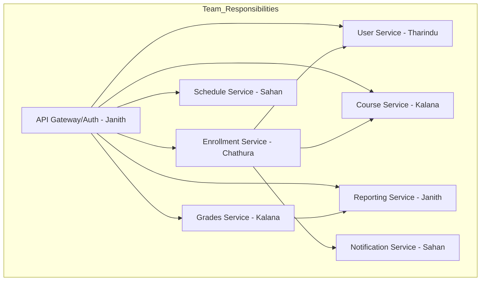

# 🎓 Nexus Enroll


## 1. Backend Architecture Overview

### Microservices (bounded contexts)
- **user-service** – Users, roles, user states (Active/Suspended/Pending)
- **course-service** – Courses, Classes, Prerequisites
- **enrollment-service** – Add/Drop + atomic transactions (Proxy)
- **notification-service** – Sends notifications (Observer)
- **schedule-service** – Calendar-like views (Decorator)
- **reporting-service** – Report export (Adapter)
- **grades-service** – Batch grade processing (Command)
- **api-gateway** *(optional)* – Routing / auth / aggregation


## Microservices Responsibility Chart

## 📋 Microservices Responsibility Table

| Service             | Owner     | Responsibility                                   |
|---------------------|-----------|-------------------------------------------------|
| **User Service**    | Tharindu  | Manage users, roles, and states (Active/Suspended/Pending) |
| **Course Service**  | Kalana    | CRUD operations on courses, classes, prerequisites, capacity |
| **Enrollment Service** | Chathura | CRUD operations, atomic Add/Drop, waitlist handling |
| **Notification Service** | Sahan   | Pub/Sub notifications (Email, SMS, Web) |
| **Schedule Service** | Sahan    | Build flexible calendar views (Decorator pattern) |
| **Reporting Service** | Janith   | Export reports in CSV/XLSX/PDF (Adapter pattern) |
| **Grades Service**  | Kalana    | Batch grade processing (Command pattern) |
| **API Gateway / Auth** | Janith   | Edge routing, user validation, aggregation (Optional) |





### File Structure

```
/NexusEnroll/
│
├── api-gateway/                        # Optional edge gateway
│   ├── src/
│   │   ├── routes/                     # Route definitions & aggregations
│   │   ├── middleware/                 # Auth, logging, rate-limiting
│   │   ├── services/                   # Calls to backend services
│   │   ├── __init__.py (or main.go, etc.)
│   │
│   ├── Dockerfile
│   └── package.json (or go.mod, etc.)
│
├── user-service/
│   ├── src/
│   │   ├── controllers/                # REST/GraphQL endpoints
│   │   ├── models/                     # User, Role, UserState
│   │   ├── services/                   # Business logic
│   │   ├── repositories/               # DB access
│   │   ├── events/                     # Publish user events (created, suspended)
│   │   ├── __init__.py
│   │
│   ├── tests/
│   ├── Dockerfile
│   └── package.json
│
├── course-service/
│   ├── src/
│   │   ├── controllers/                # Manage courses, classes
│   │   ├── models/                     # Course, Class, Prerequisites
│   │   ├── services/                   # Capacity mgmt, validation
│   │   ├── repositories/
│   │   ├── events/                     # Publish updates for enrollment-service
│   │   ├── __init__.py
│   │
│   ├── Dockerfile
│   └── package.json
│
├── enrollment-service/
│   ├── src/
│   │   ├── controllers/                # Add/Drop endpoints
│   │   ├── services/                   # Atomic transaction logic
│   │   ├── models/                     # Enrollment, Waitlist
│   │   ├── repositories/
│   │   ├── events/                     # Notify capacity/waitlist changes
│   │   ├── sagas/                      # Orchestrate cross-service transactions
│   │   ├── __init__.py
│   │
│   ├── Dockerfile
│   └── package.json
│
├── notification-service/
│   ├── src/
│   │   ├── subscribers/                # Listen to pub/sub topics
│   │   ├── channels/                   # Email, SMS, WebPush adapters
│   │   ├── services/                   # Observer logic
│   │   ├── __init__.py
│   │
│   ├── Dockerfile
│   └── package.json
│
├── schedule-service/
│   ├── src/
│   │   ├── controllers/
│   │   ├── decorators/                 # Flexible calendar decorators
│   │   ├── services/                   # Calendar building logic
│   │   ├── __init__.py
│   │
│   ├── Dockerfile
│   └── package.json
│
├── reporting-service/
│   ├── src/
│   │   ├── controllers/                # Endpoints to export reports
│   │   ├── adapters/                   # CSV, XLSX, PDF exporters
│   │   ├── services/                   # Data aggregation
│   │   ├── __init__.py
│   │
│   ├── Dockerfile
│   └── package.json
│
├── grades-service/
│   ├── src/
│   │   ├── commands/                   # Batch grade commands
│   │   ├── handlers/                   # Command pattern handlers
│   │   ├── models/                     # Grade, Assignment, BatchJob
│   │   ├── services/
│   │   ├── __init__.py
│   │
│   ├── Dockerfile
│   └── package.json
│
├── common-libs/                        # Shared libraries (optional)
│   ├── auth/                           # JWT, OAuth utils
│   ├── events/                         # Event bus/pubsub abstraction
│   ├── db/                             # Common DB clients/config
│   └── logger/                         # Shared logging
│
├── docker-compose.yml     
│
└── README.md


```


# 📌 Service Method Lists

### **User Service**

Handles student, faculty, and admin accounts, roles, and states.

* `createUser(userData)` → `User`
* `getUser(userId)` → `User`
* `updateUser(userId, updates)` → `User`
* `changeUserState(userId, state: Active|Suspended|Pending)` → `User`
* `assignRole(userId, role: Student|Faculty|Admin)` → `User`
* `listUsers(filters)` → `List<User>`

---

### **Course Service**

Manages course catalog, prerequisites, and capacity.

* `browseCourses(keywords, filters)` → `List<Course>`
* `getCourse(courseId)` → `Course`
* `getCourseCapacity(courseId)` → `{ total: int, remaining: int }`
* `getCoursesTrendingData()` → `List<CourseTrend>`
* `updateCourseInfo(courseId, updates)` → `Course`
* `listPrerequisites(courseId)` → `List<Course>`

---

### **Enrollment Service**

Responsible for Add/Drop and atomic enrollment transactions.

* `enrollStudent(studentId, courseId)` → `EnrollmentResult { status: ENROLLED|WAITLISTED|FAILED }`
* `dropStudent(studentId, courseId)` → `DropResult { status: SUCCESS|FAILED }`
* `getEnrollments(studentId)` → `List<Enrollment>`
* `validateEnrollment(studentId, courseId)` → `ValidationResult`
* `processWaitlist(courseId)` → `UpdatedWaitlist`

---

### **Notification Service**

Observer-based pub/sub notification delivery.

* `subscribe(eventType, channel, target)` → `SubscriptionId`
* `sendNotification(userId, message, channel: Email|SMS|Web)` → `NotificationResult`
* `publishEvent(eventType, payload)` → `void`
* `listSubscriptions(userId)` → `List<Subscription>`

---

### **Schedule Service**

Builds personalized calendars (Decorator pattern).

* `getStudentSchedule(studentId, semester)` → `ScheduleView`
* `addCalendarDecorator(scheduleView, decoratorType)` → `ScheduleView`
* `generateCalendar(studentId, format: Weekly|Monthly)` → `CalendarExport`

---

### **Reporting Service**

Adapter for exporting reports in multiple formats.

* `generateEnrollmentReport(filters, format: CSV|XLSX|PDF)` → `ReportFile`
* `generateFacultyWorkloadReport(filters, format)` → `ReportFile`
* `generateCoursePopularityReport(filters, format)` → `ReportFile`

---

### **Grades Service**

Command pattern for batch grade submissions.

* `submitGrades(courseId, gradeBatch)` → `SubmissionResult`
* `getGrades(studentId)` → `List<Grade>`
* `processGradeCommand(command: GradeCommand)` → `CommandResult`
* `approveGrades(courseId)` → `ApprovalResult`

---

###  (Auth Service / Middleware API) Gateway 

Unified edge entrypoint for routing, auth, and aggregation.

* `login(username, password)` → `AuthToken`
* `aggregateStudentDashboard(studentId)` → `DashboardView`
* `routeRequest(service, endpoint, payload)` → `Response`


# How to Connect Services

## 1. **Enroll Student Flow** (Add course)

1. **Student** calls **API Gateway** (`POST /enroll`).
2. **API Gateway** forwards request to **Enrollment Service**.
3. **Enrollment Service** queries **Course Service** (capacity, prerequisites).
4. **Course Service** returns capacity & prerequisite validation.
5. **Enrollment Service** queries **User Service** (student status: Active/Suspended).
6. **User Service** returns student info.
7. **Enrollment Service** executes atomic transaction (add course, update capacity, waitlist if needed).
8. **Enrollment Service** publishes event (`enrollment.created`) to **Notification Service**.
9. **Enrollment Service** returns enrollment result to **API Gateway**.
10. **API Gateway** responds to **Student**.

---

## 2. **Drop Student Flow** (Remove course)

1. **Student** calls **API Gateway** (`DELETE /enrollments/{courseId}`).
2. **API Gateway** forwards request to **Enrollment Service**.
3. **Enrollment Service** validates enrollment (check if student is enrolled).
4. **Enrollment Service** updates course enrollment list & releases a seat.
5. **Enrollment Service** calls **Course Service** (update capacity).
6. **Enrollment Service** processes waitlist (move next student from waitlist → enrolled).
7. **Enrollment Service** publishes event (`enrollment.dropped` or `waitlist.promoted`) to **Notification Service**.
8. **Enrollment Service** returns drop result to **API Gateway**.
9. **API Gateway** responds to **Student**.

---

## 3. **Browse Courses Flow**

1. **Student** calls **API Gateway** (`GET /courses?filters`).
2. **API Gateway** forwards request to **Course Service**.
3. **Course Service** queries its database for course info.
4. **Course Service** returns matching courses (name, description, schedule, prerequisites, capacity).
5. **API Gateway** responds with course list to **Student**.

---

## 4. **Submit Grades Flow** (Faculty)

1. **Faculty** calls **API Gateway** (`POST /grades`).
2. **API Gateway** forwards request to **Grades Service**.
3. **Grades Service** verifies **User Service** (faculty role/permissions).
4. **User Service** returns faculty info.
5. **Grades Service** executes batch grade processing (Command pattern).
6. **Grades Service** updates student records.
7. **Grades Service** triggers **Reporting Service** (workload updates, analytics).
8. **Grades Service** publishes event (`grades.submitted`) to **Notification Service**.
9. **Grades Service** returns result to **API Gateway**.
10. **API Gateway** responds to **Faculty**.

---

## 5. **Schedule Building Flow** (Student Calendar)

1. **Student** calls **API Gateway** (`GET /schedule`).
2. **API Gateway** forwards request to **Schedule Service**.
3. **Schedule Service** queries **Enrollment Service** (get enrolled courses).
4. **Enrollment Service** returns list of courses.
5. **Schedule Service** applies **Decorator pattern** (weekly, monthly, color coding, clash highlighting).
6. **Schedule Service** generates final calendar view.
7. **Schedule Service** returns calendar to **API Gateway**.
8. **API Gateway** responds to **Student** with calendar view.

---

## 6. **Reporting Flow** (Administrator)

1. **Administrator** calls **API Gateway** (`GET /reports?type=enrollment`).
2. **API Gateway** forwards request to **Reporting Service**.
3. **Reporting Service** aggregates data from **Enrollment Service**, **Course Service**, **Grades Service**.
4. **Reporting Service** transforms data using **Adapter pattern** into requested format (CSV/XLSX/PDF).
5. **Reporting Service** returns file to **API Gateway**.
6. **API Gateway** responds to **Administrator** with report.

---

## 7. **Notifications Flow** (Triggered Events)

1. An event occurs in **Enrollment Service**, **Grades Service**, or **Course Service**.
2. Event is published to **Notification Service** (via pub/sub).
3. **Notification Service** checks subscriptions (who needs to be notified).
4. **Notification Service** sends notification via Email/SMS/Web.
5. User (Student/Faculty/Admin) receives notification.


# Frontend Architecture


## how to run Run
| Go to inside ./frontend
1. cd ./frontend
2. npm i
3. npm run api # starts json-server on http://localhost:3001
4. npm run dev # starts React app on http://localhost:5173


## Where patterns live
- Facade: src/patterns/facade/EnrollmentFacade.ts
- Repository: src/patterns/repository/CourseRepository.ts
- Strategy: src/patterns/strategy/validation.ts
- Command: src/patterns/command/commands.ts
- Observer: src/patterns/observer/EventBus.tsx
- Adapter: src/services/apiClient.ts (ApiError)
- Factory (example idea): could add a NotificationFactory to build Notification objects per type.